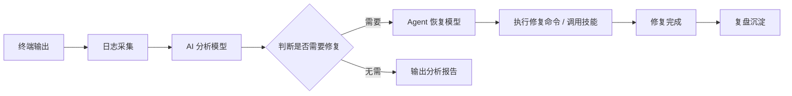
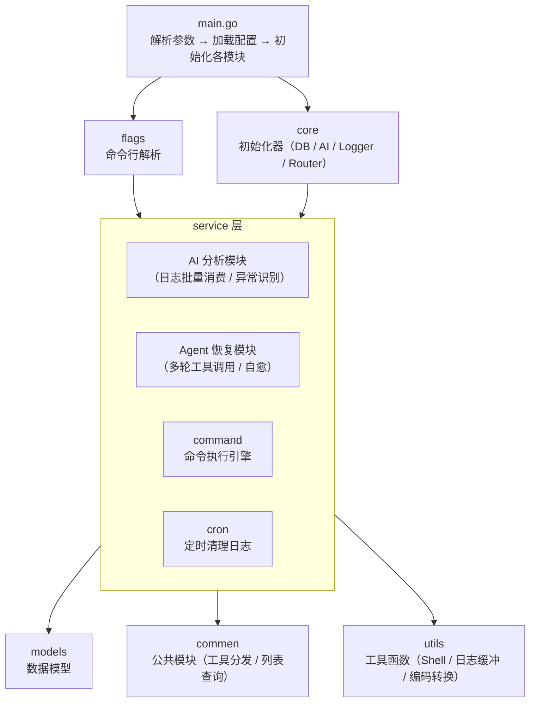

# AutoOps

> AI 驱动的自动化运维工具 — 终端命令执行、日志智能分析、故障自动恢复
>
> ⚠️ **Demo 级项目**：本项目目前处于概念验证阶段，仅供学习参考，不建议直接用于生产环境。
---

## 目录

- [简介](#简介)
- [核心特性](#核心特性)
- [架构概览](#架构概览)
- [快速开始](#快速开始)
- [配置说明](#配置说明)
- [使用指南](#使用指南)
  - [命令行模式](#命令行模式)
  - [终端模式](#终端模式-tmod)
  - [AI 助手模式](#ai-助手模式-cmod)
  - [远程调用](#远程调用)
- [技能系统](#技能系统)
  - [内置技能](#内置技能)
  - [创建新技能](#创建新技能)
- [项目结构](#项目结构)
- [许可证](#许可证)

---

## 简介

AutoOps 是一款 AI 增强的自动化运维工具，它将 **终端命令执行**、**实时日志采集**、**AI 智能分析** 和 **故障自动恢复** 融为一体。当系统出现异常时，AutoOps 能自动识别问题、调用 AI 模型分析根因，并通过预置的修复技能或直接执行 Shell 命令完成自愈。

核心工作流：



---

## 核心特性

- **多模式运行**
  - 命令行参数模式：一次性执行命令并分析日志
  - 终端模式 (`-tmod`)：交互式终端，支持 Ctrl+S 中断
  - AI 助手模式 (`-cmod`)：终端内嵌 AI 助手，`?` 前缀直接对话

- **AI 双模型架构**
  - **分析模型**：每 5 秒批量消费日志，识别异常并决定是否触发恢复
  - **恢复模型 (Agent)**：多轮工具调用，自动执行 Shell 命令、查询日志、读取技能手册完成自愈

- **技能系统**
  - 支持 `-t skill` 交互式创建新技能
  - 修复成功后自动复盘，判断是否值得沉淀为新技能

- **多数据库支持**
  - SQLite（默认，零配置）
  - MySQL / PostgreSQL（生产环境）
  - 主库与 AI 库独立，防止 AI 操作影响业务数据

- **HTTP API 服务**
  - `POST /command` — 远程执行命令
  - `GET /logList` — 分页查询日志
  - `GET /log/:id` — 详情查询

- **定时任务**：每 10 分钟自动清理 30 天前的历史日志

- **跨平台**：Windows / Linux，自动处理 GBK -> UTF-8 编码转换

---

## 架构概览



---

## 快速开始

### 环境要求

- Go 1.25+
- 任意 OpenAI 兼容的 API（或本地模型如 Ollama）

### 构建

```bash
git clone <your-repo-url>
cd AutoOps
go build -o AutoOps .
```

### 初始化配置

```bash
./AutoOps -t init
```

这会生成 `settings.yaml` 默认配置文件。随后编辑该文件，填入你的 AI API 信息。

### 最小配置（使用本地 Ollama）

```yaml
run_mode: "develop"

log:
  app: "AutoOps"
  dir: "logs"
  log_level: "debug"

db:
  sql_name: "sqlite"
  db_name: "autoops.db"

analys_ai:
  model: "qwen2.5:7b"
  temperature: 0.7
  host: "http://localhost:11434/v1"
  ApiKey: "ollama"
  apiType: "openai"

system:
  ip: "127.0.0.1"
  port: "8080"
```

### 验证连通性

```bash
./AutoOps -t test
```

---

## 配置说明

完整配置参见 `flags/example.yaml`。主要配置项：

| 配置块         | 字段                           | 说明                                   |
|---------------|--------------------------------|----------------------------------------|
| `run_mode`    | —                              | 运行模式，`develop`（调试）/ `release`（生产） |
| `log`         | `app` / `dir` / `log_level`   | 日志服务名、目录、级别                    |
| `db`          | `sql_name` / `db_name` / ...  | 主数据库（支持 `sqlite` / `mysql` / `postgresql`） |
| `ai_db`       | （同上）                        | AI 专用数据库，与主库隔离                  |
| `analys_ai`   | `model` / `host` / `ApiKey`   | AI 分析模型                              |
| `agent_ai`    | `model` / `host` / `ApiKey`   | AI 恢复模型                              |
| `terminal_log`| `app` / `alert_level` / `level`| 终端日志采集与告警配置                     |
| `system`      | `ip` / `port` / `allow_rpg` / `allow_remote` | HTTP 服务开关与地址           |

---

## 使用指南

### 命令行模式

```bash
# 执行单条命令
./AutoOps -c "ls -la"

# 通过 JSON 批量执行多个命令
./AutoOps -t r -s /path/to/commands.json

# JSON 格式示例
# [{ "command": "systemctl status nginx", "option": {...} }, ...]
```

### 终端模式 (`-tmod`)

```bash
./AutoOps -tmod
```

进入后像普通终端一样输入命令，按回车执行。按 `Ctrl+S` 然后回车可中断当前任务。输入 `exit` 退出。

### AI 助手模式 (`-cmod`)

```bash
./AutoOps -cmod
```

- 直接输入命令：执行并显示结果，自动发送给 AI 分析
- `?` 前缀：不执行命令，直接将后续内容发给 AI 对话
- `exitcmod`：退出

### 远程调用

启用 `system.allow_rpg: true` 后：

```bash
# 远程执行命令
curl -X POST http://127.0.0.1:8080/command \
  -H "Content-Type: application/json" \
  -d '{"command": "df -h"}'
```

> **安全警告**：`allow_rpg` 允许远程调用任意命令，建议仅在可信网络内开启，并自行添加鉴权中间件。

---

## 技能系统

技能是存放在 `skills/` 目录下的预定义修复手册，AI 恢复模型会在遇到匹配场景时自动查阅和执行。


### 创建新技能

```bash
./AutoOps -t skill
```

按提示输入技能名称、描述和详情，系统会在 `skills/<name>/skill.json` 生成模板。

技能 JSON 结构：

```json
{
  "skill": "my_skill_name",
  "description": "一句话描述何时使用及核心动作",
  "detail": "详细的触发条件、修复步骤、验证方法和适用范围"
}
```

---

## 项目结构

```
AutoOps/
├── main.go              # 入口
├── flags/               # 命令行参数解析与交互模式
│   ├── enter.go         # 参数定义与路由
│   ├── Run.go           # 命令执行入口
│   ├── Skill.go         # 技能创建
│   ├── mods.go          # Tmod / Cmod 交互循环
│   ├── ConnectTest.go   # 连通性测试
│   ├── init.go          # 配置文件初始化
│   └── example.yaml     # 配置模板
├── core/                # 初始化器
│   ├── init_conf.go     # YAML 配置加载
│   ├── init_DB.go       # 数据库连接
│   ├── init_ai.go       # AI 客户端初始化
│   ├── init_logrus.go   # 日志系统
│   └── init_router.go   # HTTP 路由与 API
├── conf/                # 配置结构体定义
├── global/              # 全局变量（Config、DB、AI Client）
├── models/              # 数据模型
├── service/
│   ├── AI/              # AI 分析模块（日志分析、Cmod 对话）
│   ├── Agent/           # AI 恢复模块（多轮工具调用、技能、复盘）
│   ├── command/         # 命令执行引擎
│   └── cron/            # 定时任务
├── commen/              # 公共模块（工具调用分发器、列表查询）
├── utils/               # 工具函数（Shell 执行、日志缓冲、编码转换）
└── skills/              # 技能库
    ├── apt_dpkg_configure/
    ├── docker_daemon_reload/
    ├── kubelet_cni_bootstrap/
    ├── kubelet_swap_off/
    ├── nginx_stale_pid/
    ├── redis_overcommit_memory/
    └── selinux_nginx_8443/
```

---

## 许可证

[MIT License](LICENSE)

---

## 免责声明

AutoOps 的 Agent 恢复模型拥有 Shell 执行权限，虽然系统内置了危险命令拦截规则（禁止 `rm -rf`、`shutdown`、`reboot` 等），但仍建议：

- 在生产环境使用前充分测试
- 以最小权限运行 AutoOps 进程
- 启用 `allow_rpg` 时务必添加鉴权和网络隔离
